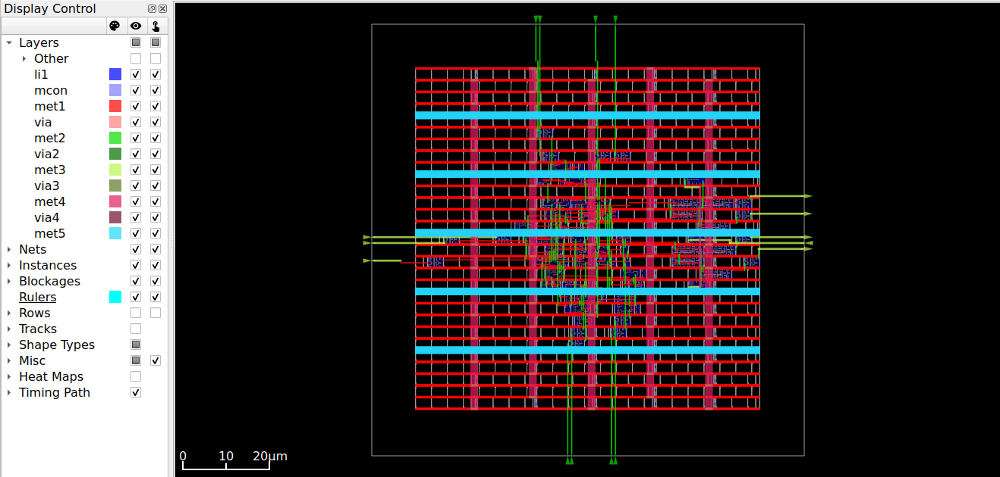
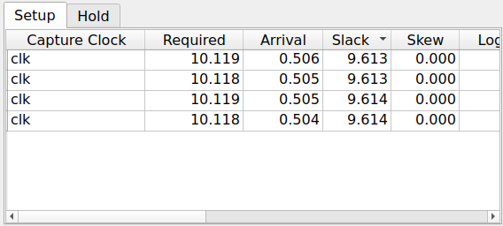
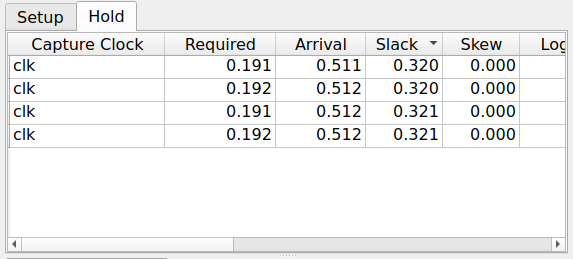
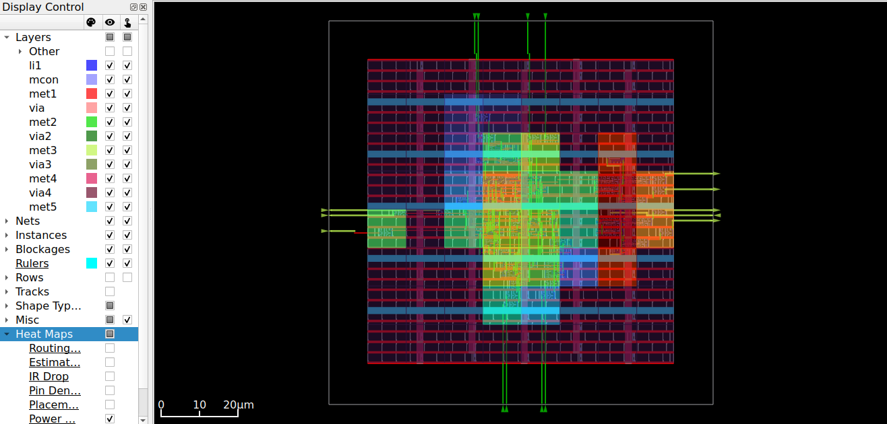

# ASIC Design of 4-bit ALU using OpenROAD (SKY130)

## 📌 Overview
This project implements a 4-bit Arithmetic Logic Unit (ALU) using the OpenROAD flow targeting the SKY130HD technology node.  
The design demonstrates a complete RTL-to-GDSII ASIC flow including synthesis, floorplanning, placement, clock tree synthesis, routing, and timing analysis.

---

## ⚙️ Features
- 4-bit ALU design
- Supported operations:
  - Addition
  - Subtraction
  - AND
  - OR
  - XOR
- Fully implemented using open-source EDA tools

---

## 🛠️ Tools & Technologies
- OpenROAD-flow-scripts (ORFS)
- SKY130HD PDK
- Yosys (Synthesis)
- OpenROAD (Physical Design)
- WSL / Linux Environment

---

## 🔄 Design Flow
1. RTL Design (Verilog)
2. Logic Synthesis
3. Floorplanning
4. Placement
5. Clock Tree Synthesis (CTS)
6. Routing
7. Static Timing Analysis (STA)

---

## 📊 Results

### 🧱 Final Layout

### ⏱️ Setup Timing

### ⏱️ Hold Timing

### 🔥 Critical Path

---

## 📈 Timing Summary
- Setup Slack: ~9.6 ns ✅
- Hold Slack: ~0.32 ns ✅
- Timing Closure Achieved

---

## 🧠 Key Learnings
- Understanding of RTL-to-GDSII flow
- Static Timing Analysis (STA)
- Importance of clock and constraints (SDC)
- Physical design stages and layout visualization
- Debugging timing and floorplanning issues

---

## 📂 Project Structure
├── alu.v
├── config.mk
├── constraint.sdc
├── README.md
└── images/

---

## 🚀 Conclusion
The ALU design was successfully implemented and achieved timing closure using OpenROAD.  
This project demonstrates practical experience in ASIC physical design using open-source tools.

---

## 👨‍💻 Author
Harshit